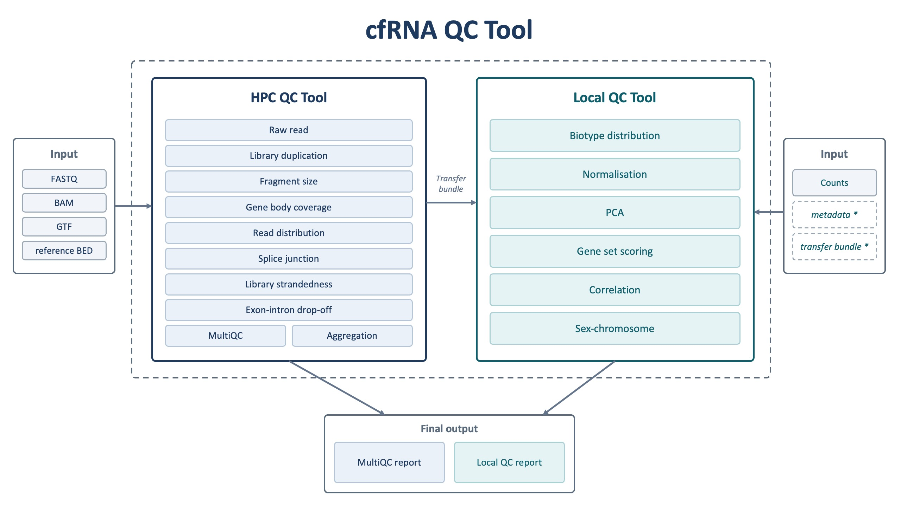

# cfRNA QC Tool

This repository contains a modular quality control workflow for cell-free RNA
sequencing (cfRNA-seq) data. It was developed as part of a master's thesis
project and is intended as a research workflow for comprehensive QC assessment,
not as fully packaged production software.

cfRNA-seq data can show problems that are not visible from one metric alone.
This workflow therefore combines sequencing-level, alignment-level,
quantification-level, per-sample, and cohort-level checks. The goal is to help
researchers inspect standard RNA-seq QC metrics together with cfRNA-specific
patterns such as fragment size profiles, gene body coverage, exon-intron
drop-off, splice junction support, biotype composition, platelet signals, and
possible DNA contamination patterns.



## Repository Structure

```text
cfRNA_QC_tool/
├── HPC_tool/
│   ├── submit_HPC_QC.sh
│   ├── requirements.yml
│   ├── config/
│   │   ├── cohortA_10samples_config.sh
│   │   └── cohortA_10samples_samplesheet.tsv
│   ├── modules/
│   └── wrappers/
├── Local_tool/
│   ├── requirements.yml
│   ├── resources/
│   └── scripts/
├── example_reports/
└── README.md
```

The workflow is split into two main parts:

- `HPC_tool/`: Bash/Slurm workflow intended for the UGent HPC cluster.
- `Local_tool/`: downstream local R scripts for count-based and cohort-level QC.

## Installation

The repository includes separate Conda environment files for the HPC and local
parts of the workflow.

```bash
conda env create -f HPC_tool/requirements.yml
conda env create -f Local_tool/requirements.yml
```

On the UGent HPC, many command-line tools may already be provided through
environment modules. The HPC scripts currently use `module load` statements for
tools such as FastQC, MultiQC, Picard, RSeQC, BEDTools, SAMtools, Kent/UCSC
tools, and Anaconda. The Conda file documents the required software stack and
can be used where installing these tools through Conda is preferred.

## Required Inputs

The HPC workflow expects pre-existing sequencing and alignment files. It does
not perform read alignment itself. It parses and summarizes files generated by
upstream workflows such as STAR alignment.

Required HPC inputs:

- FASTQ files for each sample.
- Coordinate-sorted BAM files for each sample.
- STAR `Log.final.out` files.
- STAR `SJ.out.tab` splice junction files.
- A reference GTF annotation file.
- A reference exon BED file for RSeQC-style feature distribution checks.
- A tab-separated samplesheet with one row per sample.
- A Bash config file pointing to all required paths.

Required local inputs:

- A gene count matrix, usually HTSeq-style counts.
- Optional sample metadata.
- Cached gene annotation / biotype table.
- Gene set files for platelet, cell-type, and sex-marker QC.
- Aggregated HPC QC summary output if running HPC metric versus PCA correlation.

## HPC Workflow

The HPC workflow is controlled by:

```text
HPC_tool/submit_HPC_QC.sh
```

This script reads a user-provided config file and samplesheet, generates Slurm
wrapper scripts, submits jobs, records submitted job IDs, and sets dependencies
between workflow steps.

The HPC workflow includes:

- GTF to BED12 annotation conversion.
- Drop-off bin creation.
- FastQC on raw FASTQ files.
- STAR mapping statistics parsing.
- Picard duplication metrics.
- Fragment size distribution analysis.
- RSeQC gene body coverage.
- RSeQC read distribution.
- STAR splice junction summary.
- RSeQC strandedness inference.
- Exon-intron drop-off analysis.
- MultiQC report generation.
- Final aggregation of QC metrics.

Some modules are submitted once for the full cohort. Slower or more
memory-intensive modules, including gene body coverage and exon-intron drop-off,
are submitted as one job per sample. Annotation setup runs first, QC modules run
afterward, and reporting/aggregation runs at the end. The final MultiQC and
aggregation steps use `afterany` dependencies so that summary reports can still
be generated even if one QC module fails.

### Example HPC Config

An example config is provided at:

```text
HPC_tool/config/cohortA_10samples_config.sh
```

The config is a Bash file. A minimal version looks like this:

```bash
#!/bin/bash

SAMPLESHEET="/path/to/samplesheet.tsv"
FASTQ_DIR="/path/to/fastq"
BAM_DIR="/path/to/bam"

GTF="/path/to/reference.gtf"
EXON_BED="/path/to/exons_sorted_merged.bed"

OUTDIR="/path/to/qc_output"
BED12="${OUTDIR}/annotation/reference.bed12.bed"
```

Use absolute paths where possible, especially on HPC systems.

### Example Samplesheet

The samplesheet is tab-separated and contains one row per sample:

```text
sample_id	fastq_r1	fastq_r2	bam	star_log	sj_tab	layout	condition
sample_01	/path/S1_R1.fastq.gz	/path/S1_R2.fastq.gz	/path/S1.bam	/path/S1.Log.final.out	/path/S1.SJ.out.tab	PE	CONTROL
sample_02	/path/S2_R1.fastq.gz	/path/S2_R2.fastq.gz	/path/S2.bam	/path/S2.Log.final.out	/path/S2.SJ.out.tab	PE	CASE
```

For single-end data, use the layout value expected by the modules and leave
unused paired-end fields consistently filled according to your local convention.

### Run the HPC Workflow

From the repository root or from inside `HPC_tool/`:

```bash
bash HPC_tool/submit_HPC_QC.sh HPC_tool/config/cohortA_10samples_config.sh
```

The script writes generated Slurm wrappers to:

```text
HPC_tool/wrappers/
```

It writes submission logs to:

```text
<OUTDIR>/logs/submitted_jobs.tsv
```

## Local Workflow

The local workflow contains R scripts for count-based and cohort-level QC
interpretation. These scripts are mainly in:

```text
Local_tool/scripts/
```

The local analysis includes:

- DESeq2-based count normalization.
- PCA on normalized expression matrices.
- PCA scree and scatter plots.
- Gene biotype composition analysis.
- Platelet contamination scoring.
- Other cell-type contamination scoring, including erythroid and endothelial
  gene sets.
- Sex inference using XIST and Y-chromosome marker genes.
- Correlation analysis between HPC-derived QC metrics and principal components.
- HTML report generation.

Activate the local environment before running the scripts:

```bash
conda activate cfrna-qc-local
```

### Run Individual Local Scripts

Example normalization step:

```bash
Rscript Local_tool/scripts/01_normalize_log.R \
  --counts /path/to/count_matrix.tsv \
  --out /path/to/local_qc_results/norm_log
```

Example PCA step:

```bash
Rscript Local_tool/scripts/03_pca_top_variable_genes.R \
  --expr /path/to/local_qc_results/norm_log/counts_deseq2_log2norm_plus1.tsv \
  --out /path/to/local_qc_results/pca \
  --top_n 1000
```

Example HTML report generation:

```bash
Rscript Local_tool/scripts/08_generate_html_report.R \
  --results /path/to/local_qc_results \
  --template Local_tool/scripts/08_report_template.Rmd \
  --out /path/to/local_qc_results/report \
  --title "Local cfRNA QC Report"
```

### Run the Local Master Script

The repository includes a master runner:

```text
Local_tool/scripts/run_all_local_qc.R
```

This script is designed to run all local QC steps in order and record pass/fail
status. In the current script, internal paths refer to `./r_scripts/...`, so run
it from a working directory where `r_scripts` points to the local scripts, or
adjust those paths before use.

Example command:

```bash
Rscript Local_tool/scripts/run_all_local_qc.R \
  --counts /path/to/count_matrix.tsv \
  --metadata /path/to/sample_metadata.tsv \
  --ensembl /path/to/hsapiens_gene_biotypes.tsv \
  --panglao /path/to/PanglaoDB_markers_27_Mar_2020.tsv \
  --sex_panel /path/to/sex_qc_panel_XIST_plus_5Y.tsv \
  --hpc_summary /path/to/hpc_qc_summary.tsv \
  --out_root /path/to/local_qc_results \
  --report_title "Local cfRNA QC Report"
```

## Outputs

The HPC workflow writes module-specific output directories under `OUTDIR`.
Typical outputs include:

- FastQC reports and parsed FastQC metrics.
- Mapping summaries parsed from STAR logs.
- Picard duplication metrics.
- Fragment size summaries and plots.
- Gene body coverage outputs.
- Read distribution summaries.
- Splice junction summaries.
- Strandedness inference outputs.
- Exon-intron drop-off profiles and plots.
- A MultiQC HTML report.
- A final aggregated HPC QC summary TSV.
- A transfer bundle

The local workflow writes results under the selected `out_root`. Typical outputs
include:

- Normalized expression matrices.
- PCA scores, loadings, variance tables, and plots.
- Biotype composition tables and plots.
- ssGSEA contamination score tables and plots.
- Sex-marker expression summaries and plots.
- HPC metric versus principal component correlation tables and scatter plots.
- A local HTML QC report.
- Run logs and step status tables when using the master runner.

Example generated reports are included in:

```text
example_reports/
```
